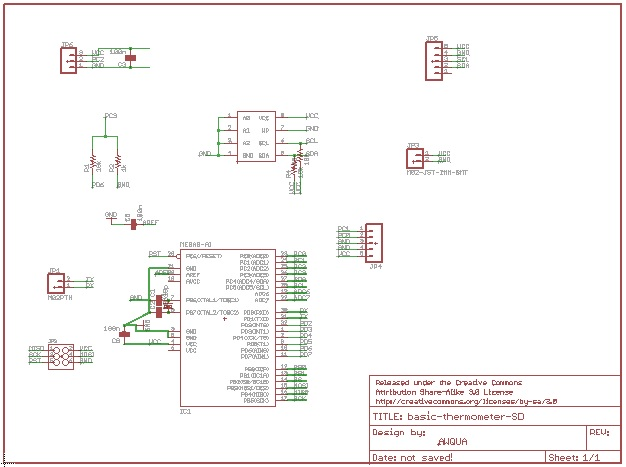
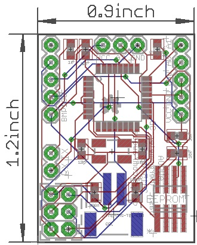

#Basic Handheld Thermometer
##Purpose  
##Function  
How does the device measure a parameter?  
How does the device-record data?  
How does the device display data?  
What units does the device report in?  
How does the device communicate data electronically?  
##Use Case  
Where can the device be safely used?  
##Power  
How is the device powered?  
How much power does it use?  
How long does it need to be recharged before re-use?  
##Standard and Testing  
How was the device tested?  
How did it perform?  
What performance standards does the device meet?  
What monitoring standards can this device be used to meet?  
##Construction  

###Bill of Materials
| Quantity  | Part Description | Example Price (each) |
| :-------------: | ------------- | :-------------: |
| 1 | ATMega328P-PU microprocessor  | [$2.90](http://www.electrodragon.com/product/atmega328-with-arduino-optiboot-uno/)|
| 1 | LMT86 temperature sensor  | [$1.00](http://www.mouser.com/ProductDetail/Texas-Instruments/LMT86LP/?qs=sGAEpiMZZMvfFCidbTccA1jyVRrxk5nB%252bTEjPRynSGM%3d)|
| 2 | 22pF ceramic capacitors  | [$0.03](http://www.mouser.com/ProductDetail/Vishay-BC-Components/K220J10C0GF5UH5/?qs=sGAEpiMZZMsh%252b1woXyUXj9nJp%252b8gphztXIKBUu3gv%252bs%3d)|
| 3 | 100nF ceramic capacitors  | [$0.06](http://www.mouser.com/ProductDetail/Vishay-BC-Components/K104Z15Y5VE5TL2/?qs=sGAEpiMZZMsh%252b1woXyUXj5VNmf0jXPWIrWjnp1zAXac%3d)|
| 1 | 1K ohm resistors 1% tolerance | [$0.10](http://www.mouser.com/ProductDetail/Vishay-Beyschlag/MBB02070C1001FCT00/?qs=sGAEpiMZZMtlubZbdhIBIAA6NYEPHyksoxlYyK2s%252btM%3d)|
| 3 | 10K ohm resistors  | [$0.10](http://www.mouser.com/ProductDetail/Vishay-Beyschlag/MBA02040C1002FCT00/?qs=sGAEpiMZZMtlubZbdhIBIP7908E9uONJr6Tgqqo7oLA%3d)|
| x | Header pins (0.1" spacing)  | [$1.50](http://www.mouser.com/)|
|||
||Total Cost:|$xx.xx|
###Circuit Board
####Schematic

####Layout

##FAQ and Troubleshooting  
###Online Resources
